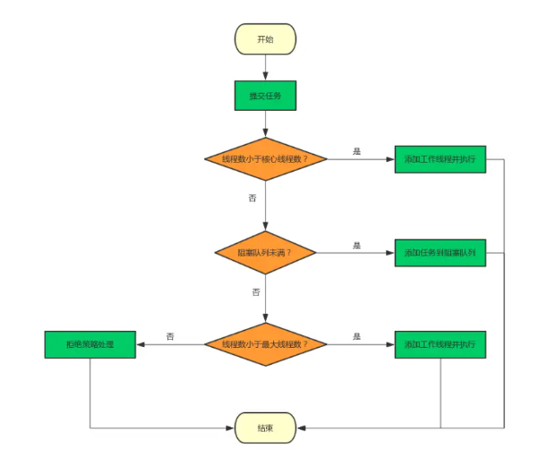
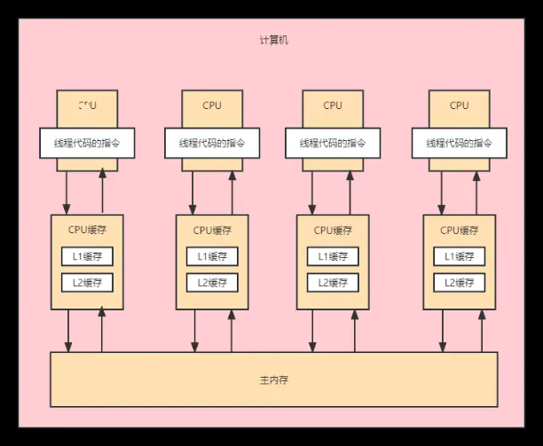
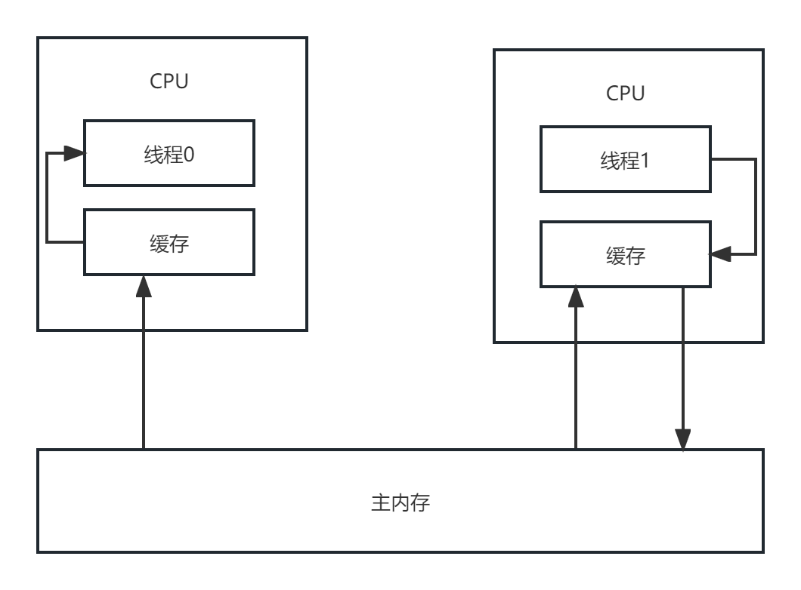
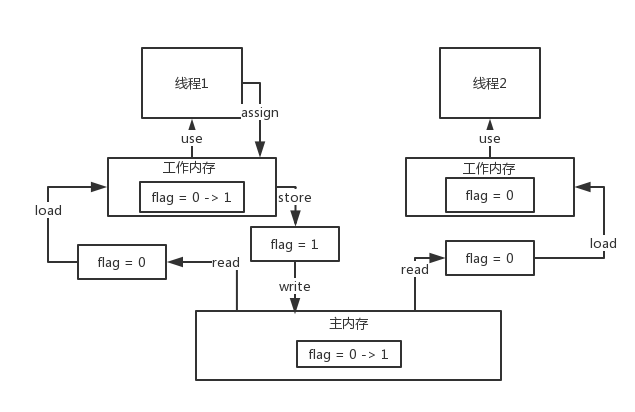

# JAVA并发编程

> 第七人格


## 谈谈你对线程池的理解

线程池可以理解为一些线程的集合，创建线程池有几个参数：

1、核心线程数

2、最大线程数

3、非核心线程的存活时间

4、存活时间单位

5、用来保存任务的队列

6、创建队列的工厂

7、线程池的拒绝策略


```java
    public ThreadPoolExecutor(int corePoolSize,
                              int maximumPoolSize,
                              long keepAliveTime,
                              TimeUnit unit,
                              BlockingQueue<Runnable> workQueue,
                              ThreadFactory threadFactory,
                              RejectedExecutionHandler handler)
```


线程池执行流程稍稍有点复杂，我们这里拿工作举例，假如你们部门一共有10个编制（最大线程数），正式编制2个（核心线程数），外包编制8个，当任务量不大的时候，老板只需要让2个正式员工做就可以了，但是有一天任务太多了，这个时候就需要招点外包人员帮助处理任务，但是不能超过总的编制。如果10个人也做不完，那么老板就会出面，决定接下来怎么做（4种拒绝策略）。如果10个人可以顺利处理掉任务，并且都没任务的积压了，大家都摸鱼一段时间了（keepAliveTime），老板就会开人，只留下2个人员（核心线程数）就可以了，但是不保证这两个人员还是以前那两个。



## 什么是daemon线程？

daemon线程，中文翻译为守护线程。

简单来说，一般工作线程是非daemon线程，后台线程是daemon线程，也就是说我们默认创建的都是工作线程，如果想要将一个线程设置为守护线程，需要调用 该线程的setDaemon(true) 方法。daemon线程和工作线程最大的区别是，如果jvm里的工作线程都停止了，那么daemon线程会跟着jvm进程一起退出。

举个例子，微服务注册中心中负责监控微服务存活状态的线程，一般设置的就是守护线程，这样如果工作线程都死了，那么jvm也就退出了，daemon线程也随着jvm的退出销毁了。


## 说一说CPU缓存模型

摩尔定律是英特尔创始人之一戈登·摩尔的经验之谈，其核心内容为：集成电路上可以容纳的晶体管数目在大约每经过18个月到24个月便会增加一倍。但是现代的计算机技术，在内存的读写速度方面却没什么突破。为了避免cpu频繁读写主内存，大佬们想了一个方法，给cpu加了几层缓存，也就是说cpu可以直接操作自己的缓存，而不需要和主内存频繁的通信，这就是CPU的缓存模型。



但是在多线程访问的情况下，该缓存模型是有问题的。比如说各个cpu的本地缓存，跟主内存没有同步，那么同一个数据在各个地方都有可能是不一致的，这就会造成并发问题。为了解决这个问题，大佬们又坐在一起，敲定了MESI协议，即缓存一致性协议。该协议主要借助cpu的嗅探机制，大致原理为：如果本地缓存修改了，那么会立马刷回主内存，其他cpu缓存也会马上清空，并重新从主内存加载数据。




## JAVA内存模型(JMM)

JMM是基于CPU缓存模型的




## 并发三大特性

原子性、可见性、有序性


## volatile是如何保证可见性的?

底层原理主要是靠lock前缀指令以及MESI协议。


## volatile为何不保证原子性?


## volatile如何保证有序性的？

happens-before原则


内存屏障


## volatile使用的场景

1、单例模式 - 双重检索

2、基于volatile优化微服务存活状态检查机制

3、基于volatile优化微服务的优雅关闭机制


## 多线程安全问题产生的根本原因

多线程并发写的问题

java内存模型


## synchronized的底层原理

同一时间只有一个线程能够读写主内存。 synchronized可以对两种对象加锁，对象实例，Class对象。 你如果用到了synchronized关键字，在底层编译后的jvm指令中，会有monitorenter和monitorexit两个指令 每个对象都有一个关联的monitor，比如一个对象实例就有一个monitor，一个类的Class对象也有一个monitor，如果要对这个对象加锁，那么必须获取这个对象关联的monitor的lock锁 他里面的原理和思路大概是这样的，monitor里面有一个计数器，从0开始的。如果一个线程要获取monitor的锁，就看看他的计数器是不是0，如果是0的话，那么说明没人获取锁，他就可以获取锁了，然后对计数器加1 这个monitor的锁是支持重入加锁的 

```java
synchronized(myObject) { 

// 一大堆的代码 synchronized(myObject) { 

// 一大堆的代码 } 

}

```


## synchronized锁升级

无锁->偏向锁->轻量级锁->重量级锁 

无锁：当一个线程第一次访问一个对象的同步块时，JVM会在对象头中设置该线程的Thread ID，并将对象头的状态位设置为“偏向锁”。这个过程称为“偏向”，表示对象当前偏向于第一个访问它的线程。 

偏向锁：偏向锁是指在只有一个线程访问对象的情况下，该线程不需要使用同步操作就可以访问对象。这种情况下，JVM会在对象头中记录该线程的ID 作为偏向锁的持有者，并将对象头中的 Mark Word 中的一部分作为偏向锁标识在这种情况下，如果其他线程访问该对象，会先检查该对象的偏向锁标识，如果和自己的线程 ID 相同，则直接获取锁。如果不同，则该对象的锁状态就会升级到轻量级锁状态。 

轻量级锁：在轻量级锁状态中，JVM 为对象头中的 Mark Word 预留了一部分空间，用于存储指向线程栈中锁记录的指针.当一个线程访问该对象时，JVM 会将对象头中的 Mark Word 复制一份到线程栈中，并在对象头中存储线程栈中C的指针。此时，如果另一个线程想要访问该对象，会发现该对象已经外干轻量级锁状态，并尝试使用 CAS 操作将线程栈中的指针替换成自己的指针。如果替换成功，则该线程获取锁成功:如果失败，则表示已经有其他线程获取了锁，则该锁状态就会升级到重量级锁状态。 

重量级锁：当锁状态升级到重量级锁状态时，JM 会将该对象的锁变成一个重量级锁，并在对象头中记录指向等待队列的指创此时，如果一个线程想要获取该对象的锁，则需要先进入等待队列，等待该锁被释放。当锁被释放时，JVM 会从等待队列中选择一个线程唤醒，并将该线程的状态设置为“就绪”状态，然后等待该线程重新获取该对象的锁。


## synchronized的3次自旋


## synchronized锁优化

锁自旋一般是用while，但是这个用得是c代码  

锁消除jvm增加逃逸分析，可以不加锁的地方，加了锁，jvm可以把他干掉  

锁粗化


## wait和notify/notifyAll


## Atomic原子类底层核心原理

CAS无锁话，乐观锁，Unsafe类 

volatile int value = 0 

valueOffset（value字段在AtomicInteger类中的位置）


## CAS无锁化原理和思路

CAS（Compare And Swap）是一种无锁化的操作技术，常用于并发编程中。其基本思路和原理如下：

无锁化设计: CAS操作不依赖于传统的互斥锁，它允许多个线程同时尝试更新共享资源，而不需要等待其他线程释放锁。
乐观锁机制: CAS是基于乐观锁的概念实现的。乐观锁假设在大多数情况下，多个线程不会同时修改同一个数据，因此不需要立即上锁，而是在数据实际被访问时再进行检查。
原子性操作: CAS通过硬件支持的原子指令来实现比较和替换操作，确保了整个操作过程中不会被打断，从而避免了多线程之间的竞争条件。
内存可见性: 当一个线程对共享变量执行CAS操作并成功时，这个操作对于其他所有线程都是可见的，这保证了内存的可见性和一致性。
失败重试机制: 如果多个线程同时尝试更新同一个值，只有其中一个线程能够成功执行CAS操作，其他线程会因为CAS操作失败而进行重试。这种机制虽然可能导致忙等待，但在某些场景下可以提高性能。
ABA问题: CAS操作存在一个被称为ABA问题的潜在风险，即一个值在被读取之后可能先被改变为另一个值，然后又变回原来的值，导致CAS操作误判为没有发生变化。解决这个问题通常需要额外的逻辑或者使用带有版本号的原子变量。
适用场景: CAS适用于那些写操作远少于读操作的场景，因为它可以减少锁带来的开销。在高竞争的环境下，CAS可能会导致性能下降，因为失败的CAS操作需要进行不断的重试。
实现方式: 在Java中，java.util.concurrent.atomic包提供了一系列的原子类，如AtomicInteger、AtomicLong等，这些类内部使用了CAS操作来保证线程安全。
与其他同步机制对比: 与传统的synchronized关键字或Lock接口提供的互斥锁相比，CAS操作提供了一种更轻量级的线程同步手段，它可以在特定条件下提供更好的性能。


## 底层CPU指令是如何实现CAS语义的

底层CPU指令实现CAS（Compare-And-Swap）语义主要依赖于处理器提供的特殊原子操作指令。这些指令可以在多线程环境下，无需锁的情况下保证对内存的原子性访问和更新。

具体来说，CAS操作通常涉及以下几个关键步骤：

读取内存位置的值：首先，CPU会读取指定内存地址上的值，这个值用于后续的比较。
比较预期值与内存值：接着，CPU会比较该内存地址当前的值是否与预期的值相等。这个预期值是CAS指令执行前，程序预先提供的。
写入新值：如果内存地址的值与预期值相同，说明没有其他线程在此期间修改过该值，CPU就会将新值写入该内存地址。
返回旧值：无论比较结果如何，CPU都会返回内存地址在操作开始时的值。
这些步骤是原子性的，意味着在整个过程中不会被其他线程的操作打断。这种原子性保证了即使在多线程并发访问同一个内存地址时，每个线程也能安全地执行CAS操作。

在不同的编程语言和平台上，CAS操作的具体实现可能会有所不同，但其底层原理都是基于CPU提供的原子操作指令。这些指令通常包括CMPXCHG（比较并交换）在x86架构上，或是LL/SC（加载链接/存储条件）在SPARC架构上。


## Atomic原子类CAS语义存在的3大问题

1、ABA问题 

2、无限循环问题LongAdder，通过分段CAS机制优化多线程自旋问题 分段迁移，某一个线程如果对一个Cell更新的时候，发现说出现了很难更新他的值，出现了多次自旋的一个问题，如果他CAS失败了，自动迁移段，他会去尝试更新别的Cell的值，这样的话就可以让一个线程不会盲目的等待一个cell的值  

3、多变量原子性问题


## ReentractLoc和ReadWriteReentractLock

底层都是基于AQS实现的


## 谈一谈AQS抽象队列同步器

其实就是2个东西，一个是队列里面放的status，还有一个就是记录的当前加锁的线程。