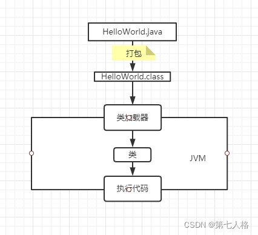
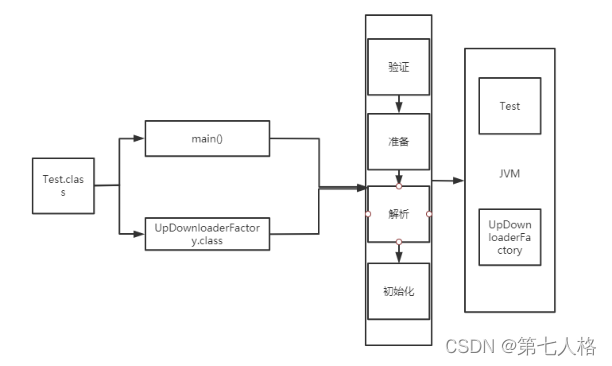
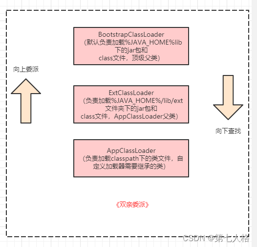
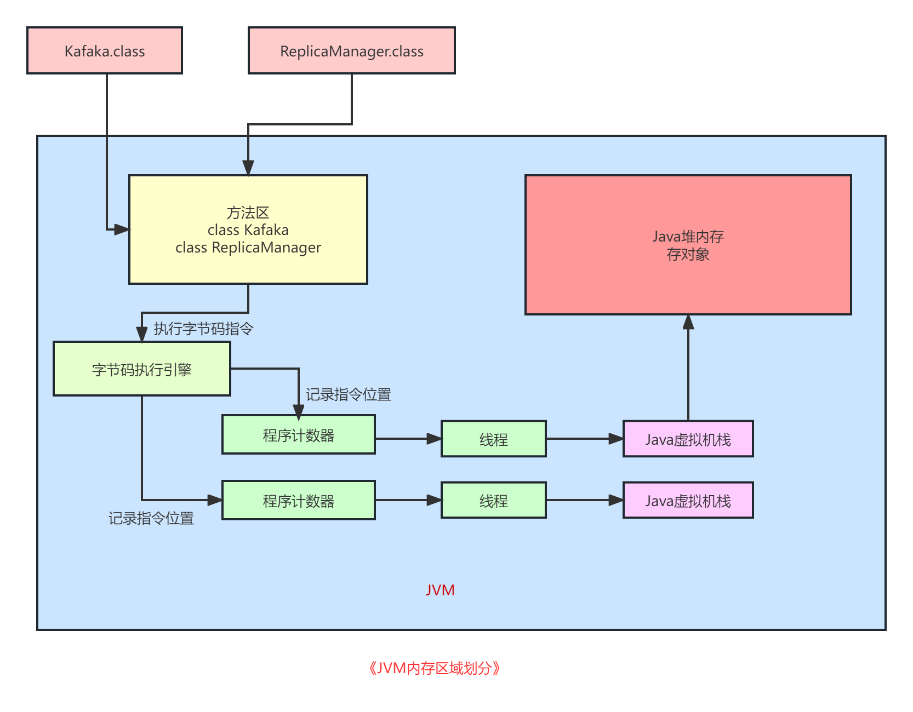
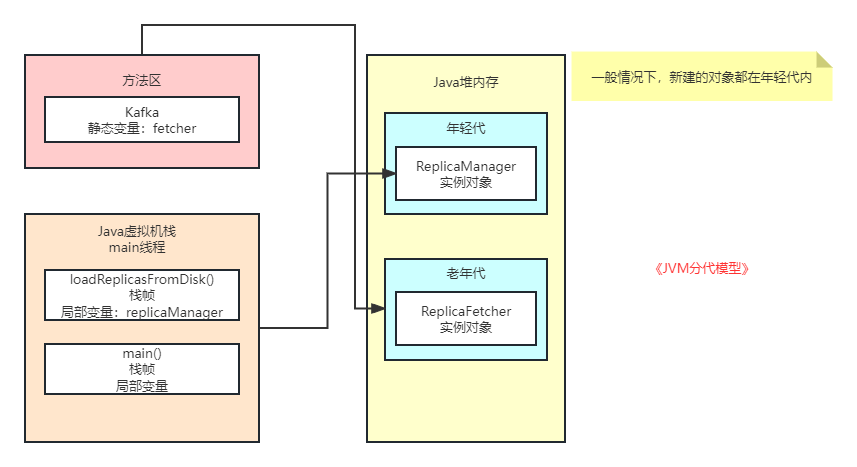
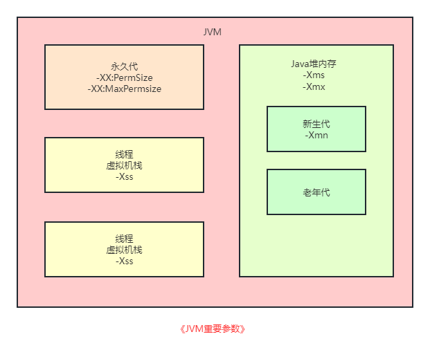
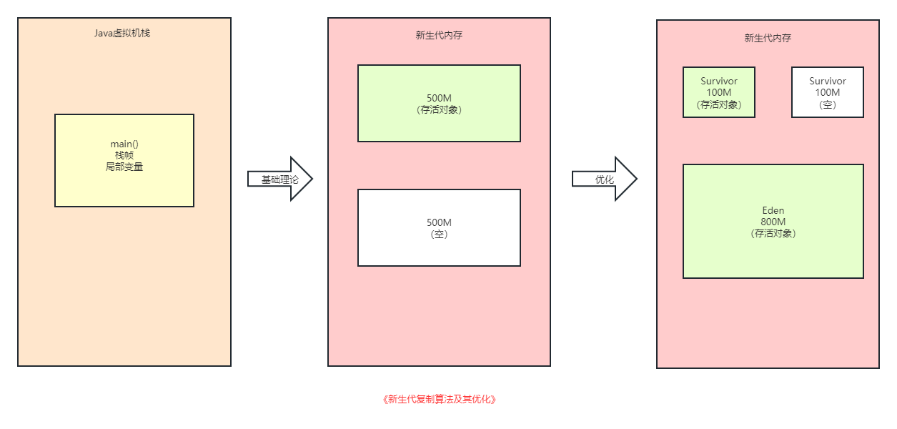
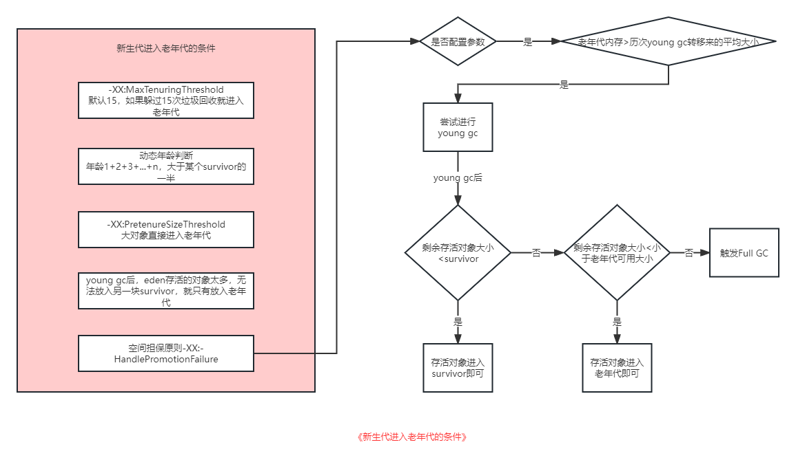
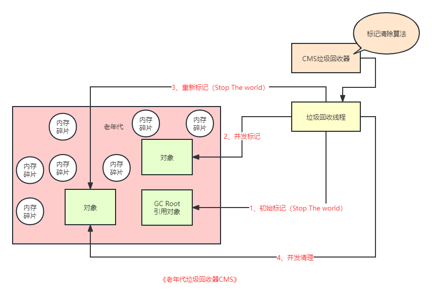
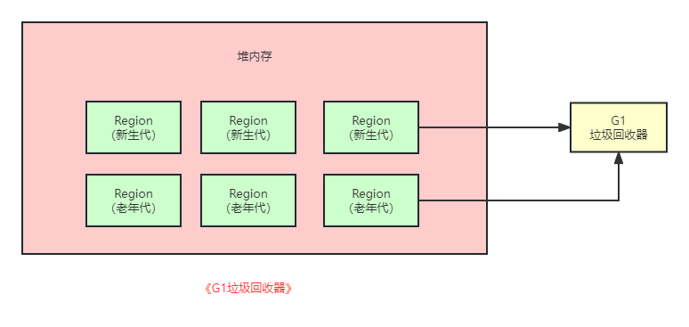

# JVM

## 程序的运行步骤

1. 首先把“.java”代码文件编译成“.class”字节码文件；
2. 然后类加载器把“.class”字节码文件中的类给加载到 JVM 中 ；
3. 接着是 JVM 执行类中的代码。

## JVM 类加载机制

关于类的加载机制，我这里总结成了3个步骤，4个阶段。

3个步骤就是程序的运行步骤

1. 首先把“.java”代码文件编译成“.class”字节码文件；
2. 然后类加载器把“.class”字节码文件中的类给加载到 JVM 中；
3. 接着是 JVM 执行类中的代码。

4个阶段为：

1. 验证这个环节主要是确定 JVM 加载的.class 文件是符合规范的，就好比男人去男厕所，女人去女厕所，符合 JVM 规范的才能进入到 JVM。
2. 准备这个环节主要是给类以及类变量分配内存空间。
3. 解析这个环节主要是把符号引用替换为直接引用。
4. 初始化这个环节主要主要做的是赋值。 

针对初始化有一个重要的规则，就是如果初始化一个类的时候，发现他的父类还没初始化，那么必须先初始化他的父类。

## 双亲委派机制

说到双亲委派，有的同学第一时间想到的就是，JAVA之父，马老师和余老师，实际上不是这样的。双亲并不是指两个爸爸，而是更像爸爸与爷爷的关系。

双亲委派主要体现在ClassLoader.loadClass方法中，说人话就是儿子想要一个东西，他会先给爸爸讲，但是爸爸不会马上给他找，爸爸会告诉爷爷，让爷爷先找有没有这个东西，如果爷爷没有找到，就会告诉爸爸，让爸爸去找。

总结成一句话就是：向上委派，向下查找。

## JVM 内存区域划分

通过JVM 的类加载机制，我们知道了类会被 JVM 加载到内存中以便使用，但是这些类被加载到内存以后，放在哪里去了呢？这个就要涉及到 JVM 的内存区域划分了。

首先我们加载了一个类，所以我们需要一块空间来存放类信息，这块空间在 JVM 中叫做元数据区或者方法区。

接着需要将.class 文件翻译成字节码，所以 JVM 使用字节码引擎，执行字节码指令，使用程序计数器，记录指令位置。

然后每一个程序计数器会对应一个线程，如果线程执行了一个方法，就会对这个方法创建一个栈帧。栈帧里包含了方法的局部变量。以上所有数据统称为 JAVA 虚拟机栈。

JAVA 虚拟机栈中的局部变量，会指向另一片区域中的对象地址，这一片存放对象的区域叫做 JAVA 虚拟机堆。

## JVM 分代模型

就像一个人按年龄被分为青年、中年、老年一样，JAVA 的 JVM也有这样的划分， 一般分为：新生代（年轻代）、老年代、永久代。 

（1）新生代一般是短期存在的对象。

（2）存在时间长的会进入老年代。

（3）一般情况下，新产生的对象，会存在于新生代中。

## 常见的 JVM 参数

## 新生代复制算法及其优化

新生代的垃圾回收算法是基于复制算法思想的。说人话就是，首先把新生代的内存分为两块，一块放存活对象，一块备用，两块空间交替使用。但是这样有个问题，比如 1G 的空间，等分成两块，那么就会有大概 500M 的空间处于空闲状态。为了减少空间的浪费，根据内存的使用频率，Java 做了优化，将空间分为了两块 Survivor 区，和一块 Eden 区。

 如果 Eden 区快满了，此时就会触发垃圾回收，把 Eden 区中的存活对象都一次性转移到一块空着的 Survivor 区。接着 Eden 区就会被清空，然后再次分配新对象到 Eden 区里。

如果下次 Eden 区满了，那么再次触发 GC，就会把 Eden 区和放着上一次 GC 后存活对象的 Survivor 区内的存活对象，转移到另外一块 Survivor 区去。这样 3 块内存循环使用，按 8:1:1 分配的话，90%的空间都得到了有效的利用。

## 新生代进入老年代的条件

（1）躲过 15 次垃圾回收，就进入老年代

（2）动态年龄判断

年龄1+年龄2+年龄3+年龄N的对象加起来的空间，大于survivor区域的一半，就会让年龄N和年龄N以上的对象进入老年代。

`注：动态年龄判断是年龄从小到大对象的占据空间的累加和，而不是某一个特定年龄对象占据的空间。`

（3）大对象直接进入老年代

这个也很好理解，你的对象都那么大了，在新生代倒来倒去不是浪费空间吗，不如早点去老年代待着。

（4）YuangGC 后，对象太多，无法放入 survivor 区

（5）空间担保原则

如果老年代的可用内存大小是小于新生代的所有对象的总大小的，看是否设置了参数 “-XX:-HandlePromotionFailure”（ 设置空间担保）。

有这个参数，就会继续尝试下一步判断，就是看看老年代的可用内存是否大于之前每一次Young GC后进入老年代的对象总和的平均大小。剩余的存活对象的值大于survivor区的内存大小，并且小于老年代可用内存大小，那么就会进入老年代。

## 老年代标记整理算法以及CMS垃圾回收器

1、初始标记（stop）

2、并发标记

3、重新标记（stop）

4、并发清理

## stop the world

如果说"hello world"代表是一个程序的开始，那么"stop the world"，就代表着程序的暂停。也就是说他会停止我们写的程序的所有工作线程，连对象也不让创建了。所以无论是年轻代GC还是老年代GC，尽量都不要让频率过高，也不要让时间过长。

## 为什么老年代的FullGC要比新生代的MinorGC慢很多？

新生代执行速度其实很快，因为直接从GC Roots出发就追踪哪些对象是活的就行了，新生代存活对象是很少的，这个速度是极快的，不需要追踪多少对象。然后直接把存活对象放入Survivor中，就一次性直接回收Eden和之前使用的Survivor了。

 CMS垃圾回收处理器呢，在并发标记阶段，他需要去追踪所有存活对象，老年代存活对象很多，这个过程就会很慢；其次并发清理阶段，他不是一次性回收一大片内存，而是找到零零散散在各个地方的垃圾对象，速度也很慢；最后完事儿了，还得执行一次内存碎片整理，把大量的存活对象给挪在一起，空出来连续内存空间，这个过程还得“Stop the World”，那就更慢了。万一并发清理期间，剩余内存空间不足以存放要进入老年代的对象了，引发了“Concurrent Mode Failure”问题，那更是麻烦，还得立马用“Serial Old”垃圾回收器，“Stop the World”之后慢慢重新来一遍回收的过程，这更是耗时了。

## G1垃圾回收器

G1垃圾回收器设计的思想，主要是把内存拆分为很多个小的Region，然后新生代和老年代各自对应一些Region，回收的时候尽可能挑选停顿时间最短以及回收对象最多的Region，尽量保证达到我们指定的垃圾回收系统停顿时间。 

最多有2048个Region。

## JVM优化思路

基本思想是：减少stop the world的频率以及持续时间。 

尽量让每次Young GC后的存活对象小于Survivor区域的50%，都留存在年轻代里。尽量别让对象进入老年代。尽量减少Full GC的频率，避免频繁Full GC对JVM性能的影响。